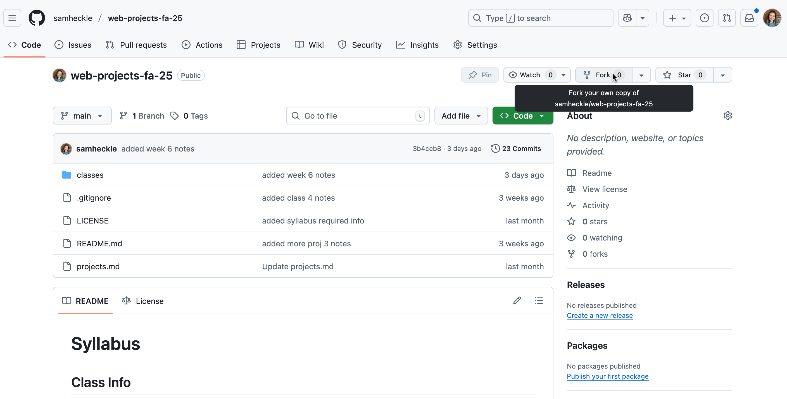
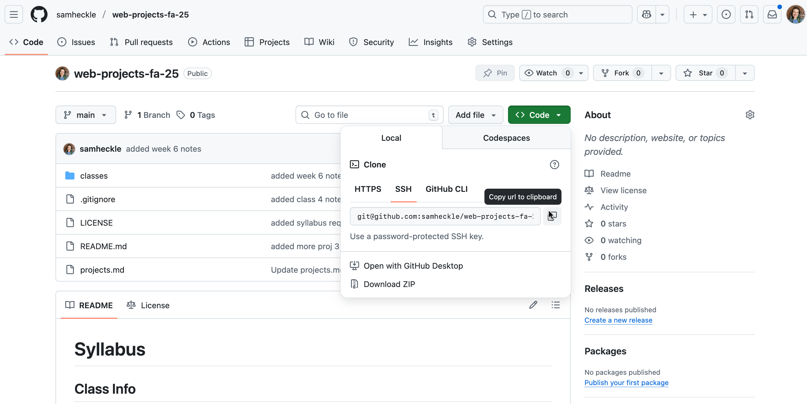

# Week 07 10/27/25

## Agenda

1. Project #3 Critique
2. Media Queries & Responsiveness
3. Partner Media Query Exercise

## Project #3 Critique

Using this [cryptpad](https://cryptpad.fr/pad/#/2/pad/edit/4pPNmdcgvyWGUmYBt4EWBEWd/) we will be doing critiques.

## Media Queries

[Media queries](https://developer.mozilla.org/en-US/docs/Web/CSS/CSS_media_queries/Using_media_queries) are ways we can add specific styles to different screen sizes. 

Media queries require one line of html, but after that everything is inside your css files. 

The html that allows us to determine the [viewport](https://developer.mozilla.org/en-US/docs/Web/HTML/Reference/Elements/meta/name/viewport#viewport_width_and_screen_width) size based off the screen.
```html
<meta name="viewport" content="width=device-width,initial-scale=1" />
```

In our css files, we can determine a lot of other styles based on the media itself. Each `@media` is a specific rule that contains nested selectors. There are lots of [media features](https://developer.mozilla.org/en-US/docs/Web/CSS/CSS_media_queries/Using_media_queries#syntax) you can modify, but for now we will focus on the common ones: media types, orientation, and screen width.

1. Determining the [type of media](https://developer.mozilla.org/en-US/docs/Web/CSS/@media#media_types)
```css
/* this determines styles when the page is printed */
@media print {
    body{
        font-size: 12px;
    }
}
/* this determines styles when the page is a screen */
@media screen{
    body{
        font-size: 16px;
    }
}
```

2. Styling for a specific orientation
```css
@media (orientation: landscape) {
  body {
    flex-direction: row;
  }
}

@media (orientation: portrait) {
  body {
    flex-direction: column;
  }
}
```

3. Lastly, we want to style for specific screen sizes, usually based off the [width property](https://developer.mozilla.org/en-US/docs/Web/CSS/@media/width). Typically, I use `min-width`, but you can use whatever works for you.
```css
/* Exact width */
@media (width: 360px) {
  div {
    color: red;
  }
}

/* Minimum width */
@media (min-width: 35rem) {
  div {
    background: yellow;
  }
}

/* Maximum width */
@media (max-width: 50rem) {
  div {
    border: 2px solid blue;
  }
}
```

### Breakpoints
When determining different screen sizes, you can use "breakpoints". This is determining any specific styling for specific screen sizes. 

MDN has a nice [explanation of breakpoints](https://developer.mozilla.org/en-US/docs/Learn_web_development/Core/CSS_layout/Media_queries#how_to_choose_breakpoints), specifically using the responsive design mode. 

You can customize your breakpoints in any way, but a common breakdown is:
| From [Bootstrap 5](https://getbootstrap.com/docs/5.0/layout/breakpoints/#available-breakpoints)| |
|---|---|
X-Small | <576px |
Small | ≥576px | 
Medium |  ≥768px |
Large| ≥992px |
Extra large |  ≥1200px |
Extra extra large |  ≥1400px |

## Partner Media Query Exercise

We are going to practice responsiveness, along with practicing how to make a pull request to make changes in somebody elses github. 

1. First, we want to make a "fork" of your partners repository. 


2. Next, you are going to clone that repository to your computer. We need to grab the url we are going to `clone`


3. Usually I put new repositories into my `dev/` folder, but you can put it wherever you want on your computer. We can do this inside of our dev folder and then use `git clone` to clone the repo
```sh


```
