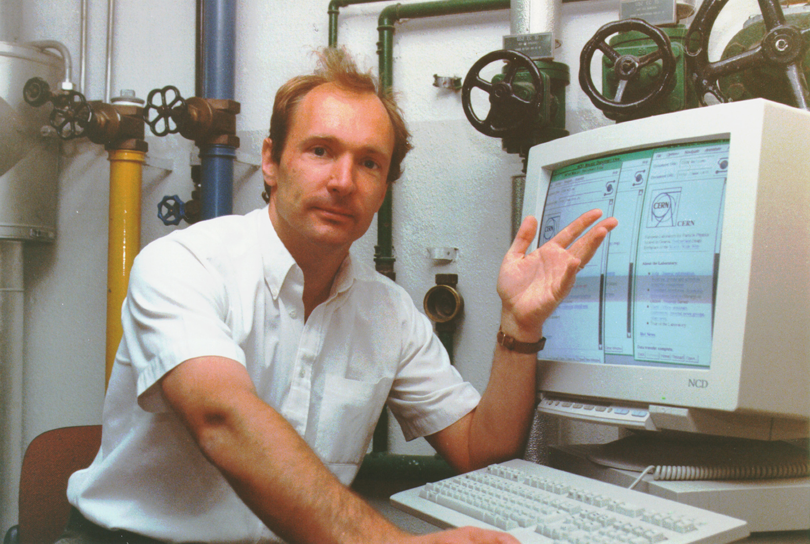

# Week 01 9/8/25

## Agenda

1) Syllabus and Class Logistics
2) Introductions
3) Lecture: Short History of the Web
4) Tutorial: HTML & CSS Basics

## Syllabus and Class Logistics

### [Syllabus](../../README.md)
* If I am ever going too fast through *any* material, please interrupt me!
* Questions? Comments? Needs? Etc? Send an email. I value open communication more than anything else. If you miss class, expect to be late, or are struggling with an assignment, please let me know.

## Introductions

### me

| sam heckle (they/she)|  |
| ----------- | ----------- |
| software engineer to creative technologist pipeline  | |
| things you can ask me about: coding, software engineering, physical computing, sewing, portfolio review, resume review, grad school, games, cats, keyboards, baking, nyc/seattle/san francisco, food | |
| please ask me about these things in [office hours](https://calendly.com/samanthaheckle/30min) |  |

### you

* name, pronouns (optional), year, program
* what interests you? what do you spend your free time doing?
* what website do you spend the most time on?
* what are you looking to get out of this class?

## Lecture: Basic Internet History

### Internet VS Web


### Computers Then vs Now


*Lyons Electronic Office (1949)*


*old telephone switches and operator*

  
*gameboy with link cables in 1990s*

### Centralization vs. Decentralization vs. Distributed


*so we have migrated from something that was centralized (where we had to physically hardwire at a central location) to something that is decentralized – which is with multiple central locations. whereas distributed shares the load equally among multiple locations. https://berty.tech/blog/decentralized-distributed-centralized*

### DARPA


JCR Licklider spearheaded an idea called the "Galactic Network", and founded the US Military agency DARPA which funded this initial research. https://www.darpa.mil/about-us/timeline/arpanet

### ARPANET

US Advanced Research Projects Agency Network 


A university-based network for sharing digital resources among geographically separated computers. https://en.wikipedia.org/wiki/ARPANET

### The internet is INTERconnected NETworks.

  
*map of the undersea cable network*

[How We Got To Now: Glass](https://vimeo.com/111450090)
* describes how glass became the backbone of our modern networking today.

### Connectivity..and then?
POST-ARPANET, we didn't have a standardized way for computers to talk to one another. 



*Tim Berners-Lee proposed Hypertext Transfer Protocol (HTTP) in 1989*.


*He published the first HTML site*

In 2010, he wrote a piece called [*Long Live the Web*](https://jblomo.github.io/webarch253/slides/Long_Live_the_Web.pdf), which goes through the history and why the web has and will continue to be important for information sharing, along with having free and public access. 

### Websites

<table>
<tbody>
<tr>
<td>HTML</td><td>what is the content</td>
</tr>
<tr>
<td>HTTP</td><td>how is the content being sent</td>
</tr>
<tr>
<td>URL</td><td> where is the content going</td>
</tr>
</tbody>
</table>


<table>
<tbody>
<tr>
<td>HTML</td><td>structure of the page</td>
</tr>
<tr>
<td>CSS</td><td>style of the page</td>
</tr>
<tr>
<td>JS</td><td> interaction on the page</td>
</tr>
</tbody>
</table>

## Getting Started with Our File Structures
1) Log In to your GitHub account
2) [Fork this repository](https://github.com/samheckle/web-projects-starter)

3) Rename your forked repository to `web-projects`
4) Create the repository
5) Open your terminal or git bash on your computer
6) Generate your ssh keys with [this tutorial](https://docs.github.com/en/authentication/connecting-to-github-with-ssh/generating-a-new-ssh-key-and-adding-it-to-the-ssh-agent)
7) Add your ssh key to your GitHub account [here](https://docs.github.com/en/authentication/connecting-to-github-with-ssh/adding-a-new-ssh-key-to-your-github-account)
8) Find a good place to store your folder on your computer. 
    
    I use a folder called `dev` which is located in my user account. So an example path to that location would be `/Users/samheckle/dev/web-projects-fa-25/`. I do this so that my file path is shorter, but if you want to put the folder on your desktop we can use that too. 

    Once you have picked a place, you need to navigate to that folder using the Command Line Interface (CLI). Think of it as a finder or file explorer where we can only view one folder at a time.

    We can navigate through our terminal with a few commands:

    * `pwd` gives us the path of the folder or directory we are in. 
    * `ls` means "list" and shows all the files that exist in the directory
    * `cd` change directory. this is how we navigate through our filesystem. 
        * `cd folderName` will put us inside a folder.
        * `cd ../` will move up one folder
9) Using our new commands, navigate to where you want your class folder to live in the CLI.   
    On MacOS from finder, I can find my folder:  
        
    and you can right click and open in terminal.  
        
    From CLI, I can run the command `cd dev` and that will bring me to my `dev` folder  
      
    We can also [customize the look of our terminals](https://medium.com/@adamtowers/how-to-customize-your-terminal-and-bash-profile-from-scratch-9ab079256380), which is why mine has my user + folder name + emoji.

        
10) Clone the repo inside of whichever folder you want it to live. Double check you are in the right location using `pwd`. From there, use `git clone` and your ssh url
  

For example, your terminal command should look like:
```sh
git clone git@github.com:samheckle/web-projects.git
```
11) Open your new folder within your preferred text editor.

## Tutorial: HTML / CSS Basics

The syntax of a comment in HTML is `<!-- -->`. We write comments to explain things that are happening in the code. It is good practice so that we can understand what is happening if we look at the code in the future. 
```html
<!-- this is a comment in HTML -->
```
In CSS, the syntax is `/* */`
```css
/* this is a comment in CSS */
```

### HTML is Structure
*H*yper-*T*ext *M*arkup *L*angauage (HTML) isn't a programming language, but a way to taxonimize (organize) words on a page.

To make an HTML page, we can create a new file in VS Code by clicking the +Document button, or right clicking in the file explorer and pressing New File.


We want to name the new file `whatever_i_want_but_no_spaces.html`. The `.html` is important for the naming (it also cannot have spaces or weird characters, I stick to `_` or `-`). 

HTML follows a particular structure. The first tag we always use in an HTML file is `<html>`. All of our code will be written between the opening and closing tags. Every HTML tag can also be called an `element`, or the thing that exists on the page. 

```html
<!-- opening -->
<html>

<!-- closing -->
</html>
```

Then we get into parent and child tags. An element that contains elements inside of it is called the `parent element`, whereas the elements inside are called `child elements`. We can have infinite nesting inside of elements. 

The typical children of the `<html>` element are `<head>` and `<body>` elements. 


The `<head>` tag contains content and meta information about the webpage the browser might need to know, like language, character set (ie alphabet), and the `<title>` tag, which allows us to set what the name of the tab is in our browser. 

It might look something like
```html
<html>
    <head>
        <title>my homepage</title>
    </head>
</html>
```

We can see a barebones HTML file structure inside of [index4.html]().

We can view any HTML pages:

1) Right clicking the file in the file explorer -> pressing Reveal in Finder, and dragging the file into our browser. 


Also important to note here, when we ***don't*** use live server, we can see the path in our address bar. Mine shows `file:///Users/samheckle/dev/web-projects/week1/index.html`. The `path` is the location in which the file exists on our computer. Our computer stores data in a series of folders, and we need to manage and keep track of those folders in order to access the specific files within them. 

The path is really important because we need to be able to know exactly where files are on our computer in order to reference them within our own code, specifically if we wanted to link two pages or add images together. Before we do that, we need to look at other html content elements. 

The content of a webpage exists inside the `<body>` element. The `<body>` can hold plaintext, but usually it will contain some type of other elements, such as:

* `<p>` - paragraphs
* `<em>` - emphasis, or italics
* `<strong>` - bold
* `` - images, uses `src` attribute which can contain a local file path or url to an image, no closing tag
* `<a>` - links, uses `href` attribute which can use local path or url to an external site.

There are also generic tags that don't have any specific type of text or formatting associated with it and are used typically as `containers` to hold other text elements. 

* `<div>` - document *div*ision, which is a block level element
* `<span>` - span, or a little piece of generic text, which is an inline element. 

|block | inline |
|---|---|
|`block` elements are stacked vertically, so they typically won't have content next to it. Think of it in like a word document where you have images "break" text. | `inline` elements are stacked horizontally, so they will usually have content side-by-side. In a word document, it is also called inline. |
 |  | 
`<p>`, `<div>` | `<em>`, `<strong>`, `<a>`, `<span>`

#### Attributes
<table>
<tbody>
<tr>
<td>attribute</td><td>additional values that configure elements inside the tag, similar to a parameter in a function.</td>
</tr>
<tr>
</tbody>
</table>

##### Links
For example, when we are looking at a link tag, we assign the attribute `href` to be the url we want the link to go to. 
```html
<a href=”index.html”></a>
```

##### Images

Images have an attribute called `src` (source)

We can source images from external urls or from our local. When we use our local, we calculate the difference between the two paths (the locations of the files). 

You can resize an image by grabbing an image with CSS (see CSS section below), and modify either the width or the height by px. I would say it is probably better to size the image externally, since you typically want to use smaller images for the web as larger images impact load time. 

#### Paths

As stated earlier, a path is the location on which our files exist on our computer. We can access the files by specifying the path in different attributes (like `src` or `href`). We need to know where we are in the file structure and where we need to go in order to determine the path from one file to another. 

For example, if we want to include an image in our `index.html`, we need to know that our path to `index.html` is 
```
file:///Users/samheckle/dev/web-projects/week1/index.html
```
Our images exist in a folder called `images/`, and if we drag our image to the browser, we can also see it's path
```
file:///Users/samheckle/dev/web-projects/week1/images/guywithguitar.jpg
```
We need to note the difference between these two paths -- we know that everything up to the end of week1 is the same, so we can ignore that part of the path. Since we need to get into the images folder, we need to specify the folder `images/` + our file name `guywithguitar.jpg`. So the path from `index.html` to our image is `images/guywithguitar.jpg`. 

So, to determine paths we need to determine the difference between to file locations. If we need to go up a folder, we can use `../`. Say we put our images not in `week1/` but in `web-projects/images/`, in order to retrieve images we need to use `../images/guywithguitar.jpg`. 

### CSS is Style
*C*ascading *S*tyle *S*heet (CSS) allows us to style elements based off rules. We do this with a stylesheet file with a `.css` extension. 

We link the stylesheet and the html using the link tag in our `<head>` element. It includes 2 attributes and has no closing tag.

```html
<link rel="stylesheet" href="style.css">
```

#### CSS Rules
<table>
<tbody>
<tr>
<td>selector</td><td>thing we are grabbing on the html page</td>
</tr>
<tr>
<td>property</td><td>thing that we want to change about the specific element</td>
</tr>
<tr>
<td>value</td><td> what are we changing that element by</td>
</tr>
</tbody>
</table>
    
```css
selector {
    property: value
}
```

#### More Attributes for CSS Selection
The selector can be any HTML tag, or it can use `class` or `id` attributes to be specific about which tag we are grabbing. 

* `class` - can apply to multiple elements, regardless of the html tag. 
* `id` - can only apply to ONE element, because we use this to retrieve elements that will be manipulated with javascript. 

In CSS, to retrieve a class selector, we use `.`:
```css
.myclass{
    color: blue;
}
```
To get an id, we use `#`:
```css
#myid{
    background-color: blue;
}
```

Properties are anything that can be manipulated in terms of style, and we only covered a few but a more substantial list exists: https://www.w3.org/Style/CSS/all-properties.en.html
- I wouldn't worry about grids, flexboxes, or position since we will get to that next week. 

## Assignment
Due 9/15 (Class 2)
- [ ] [Project #1](https://github.com/samheckle/web-projects-fa-25/blob/main/projects.md#project-1---hypertext-narrative)
