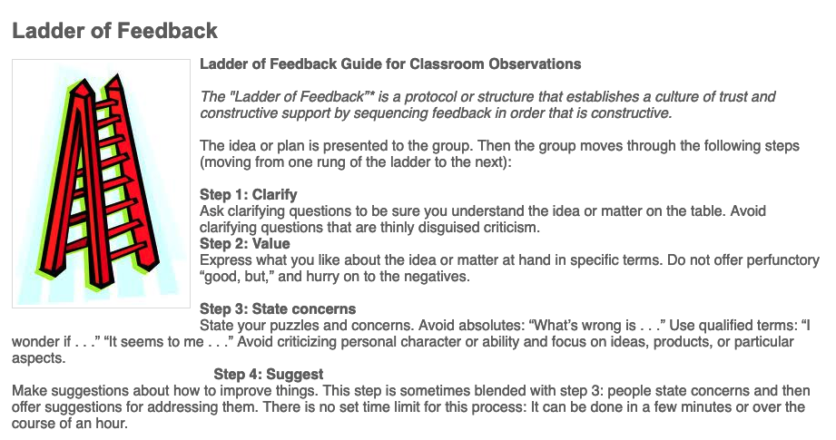
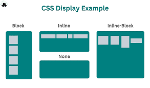
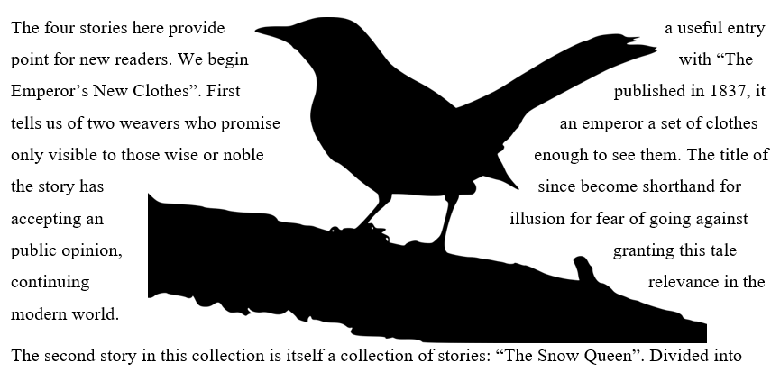
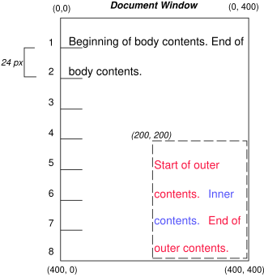
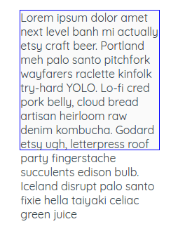
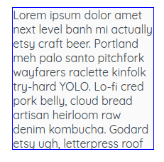
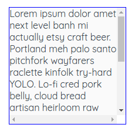
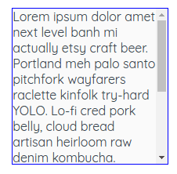

# Week 02 9/15/25

**No class 9/22**

## Agenda

1. Lecture: Web Application Infrastructure 
2. Uploading Project 1 to SFTP Server
3. Project 1 Review & Feedback
4. Minimal CSS Introduction
5. JavaScript and the DOM

## Web Application Infrastructure

When we upload to and use the web, we need to have a basic understanding of what each part of the process is. We have a couple of things to define.

***The "Cloud"*** - centers of computers (also known as server farms) that physically store data for us. When we upload something to the internet, it's data physically goes to live in one of these places. Some infrastructure services you might have used or heard: AWS, Google Cloud, Microsoft Azure, Digital Ocean, Heroku. 

***Virtual Machine*** - the actual computer space you are storing data on. in this class, we are storing our data on the `fm1` host. My address on this host is `sh8653@fm1.hunter.cuny.edu`. 

***File Transfer Protocol*** - a way to transfer files to a virtual machine. in this class, we are using Cyberduck or Filezilla.

If we were to look at the comparison between these and, let's say, a google drive:
|Web Infrastructure|Google Drive |
|---|---|
| The Cloud | Your entire account in google drive |
| Virtual Machine | A folder in google drive |
| FTP | Uploading files to google drive |

***localhost*** is defined as when we use our personal computer as the server, which can only be accessed by you on your computer

***ip address, or your hunter url*** is the virtual machine we have made public and can access. so we are on the `fm1` host using our net id username. The `address` is where my files are located. My public address is `https://film1.hunter.cuny.edu/sh8653/`

## Uploading Project 1 to SFTP Server

[OneDrive PDF Tutorial](https://cuny907-my.sharepoint.com/:b:/r/personal/samantha_heckle26_login_cuny_edu/Documents/Attachments/SFTP-How%20To.pdf?csf=1&web=1&e=ylcMfK)

Prerequisites: Downloading an SFTP Client (Filezilla or Cyberduck), having your Hunter NetId available. 

Create a new connection using the following attributes:
```
Protocol: SFTP
Host: fm1.hunter.cuny.edu
User: Your NetId
Password: Your Hunter NetId password
```

Now, you should be able to upload your folder to your SFTP client. It should have the folders you are using for this class using the [starter folder](https://github.com/samheckle/web-projects-starter) we created in class 1.

To upload your project to the web, you will drag and drop your entire `project1` folder into your SFTP client. From there, it should be accessible from `https://film1.hunter.cuny.edu/[your netId]/project1/`.

## Project 1 Review and Feedback

Process for Feedback



In the discussion post, reply with:
1) Question
    * what are you curious about with this project? 
    * where are areas you are still confused about the interaction or navigation?
2) Comment
    * what do you like specifically about the project?
    * what is working for you?
    * what does this project remind you of? any references or links to related projects?
3) Suggest
    * how would you improve this project?

## Minimal CSS Tutorial
*C*ascading *S*tyle *S*heet (CSS) allows us to style elements based off rules. We do this with a stylesheet file with a `.css` extension. 

We link the stylesheet and the html using the link tag in our `<head>` element. It includes 2 attributes and has no closing tag.

```html
<link rel="stylesheet" href="style.css">
```

#### CSS Rules
<table>
<tbody>
<tr>
<td>selector</td><td>thing we are grabbing on the html page</td>
</tr>
<tr>
<td>property</td><td>thing that we want to change about the specific element</td>
</tr>
<tr>
<td>value</td><td> what are we changing that element by</td>
</tr>
</tbody>
</table>
    
```css
selector {
    property: value
}
```

#### More Attributes for CSS Selection
The selector can be any HTML tag, or it can use `class` or `id` attributes to be specific about which tag we are grabbing. 

* `class` - can apply to multiple elements, regardless of the html tag. 
* `id` - can only apply to ONE element, because we use this to retrieve elements that will be manipulated with javascript. 

In CSS, to retrieve a class selector, we use `.`:
```css
.myclass{
    color: blue;
}
```
To get an id, we use `#`:
```css
#myid{
    background-color: blue;
}
```

Properties are anything that can be manipulated in terms of style, and we only covered a few but a more substantial list exists: https://www.w3.org/Style/CSS/all-properties.en.html

### Flow Layout

HTML documents follow [the flow layout](https://developer.mozilla.org/en-US/docs/Web/CSS/CSS_display/Flow_layout)

> The flow is essentially a set of things that are all working together and know about each other in  your layout.


The flow is comprised of `block` and `inline` elements. We are able to break the flow by modifying the default attributes.

#### Display



* block: vertically arranged (with a new line)
* inline: horizontally arranged
* inline-block: horizontally + vertically arranged
* none: hidden on the page, is not in the layout

#### Float



Allows content to flow along the side, like using text wrap around an image in a word.

#### Position

We can position things on a page using two properties `relative` and `absolute`. Relative positions set the origin point of the container, and absolute positions allow us to modify how much we move the contents. 



We always need to use these in conjunction with one another. 

Absolute positioning also uses `top`, `bottom`, `left`, and `right` to position from the edge of the relative container's top left corner.

#### Overflow

<table>
<tbody>
<tr>
<td>visible: shows the content, despite overflowing the container</td><td></td>
</tr>
<tr>
<td>hidden: chops the content based on the size of the container</td><td></td>
</tr>
<tr>
<td>scroll: adds a scroll bar to the container</td><td></td>
</tr>
<tr>
<td>overflow-y, overflow-x: allows us to modify which axis we use</td><td></td>
</tr>
</tbody>
</table>

## Document Object Model (DOM)


When we want to use JavaScript on our webpages, we need to know how JavaScript understands and interacts with our HTML pages. This is through the *Document Object Model* (DOM). This is the entire HTML structure of a page that JavaScript can manipulate content (HTML), style (CSS), or the structural (HTML) changes

The way we will be writing comments in JavaScript is 
```js
// this is a comment in javascript
```

We add JavaScript to a page using the `<script></script>` tag. It is injected into the `<head>` element and includes an `src` attribute, which will have the `path` to our JS file.

```html
<html>
	<head>
		<script src="script.js"></script>
	</head>
	
	<body>
		Nothing to see here.
	</body>
</html>
```

To ensure we have linked our files correctly, we can use a couple of methods to give us information from our JS file.

```js
alert('Hello this is Javascript speaking!') // this makes a popup show up on the page
console.log('This is a message in the console') // this adds a message to the inspector
```

### Waiting for the page to load

In order for use to use any JavaScript on a page:
1) We must wait for the DOM to load 
    * everything must exist on the page first before we modify any of it. 
2) We have an event that automatically tells us when we can start using JavaScript

In this class, we will *always* be using:
```js
window.onload = () => {
  console.log("page is fully loaded");
};
```

This is a bit weird, so let's break it down:
* `window`: the browser window, which will give us information about the window we are looking at.
    * `window.innerWidth` is a common property to give us the size of the current window, `innerHeight` also exists.
* `window.onload`: the event handler property from `window`, which triggers once the page has successfully loaded. see [mdn docs for load event](https://developer.mozilla.org/en-US/docs/Web/API/Window/load_event)
* `() => {}`: this is an `anonymous function`, which allows us to trigger a function based off the event. an equivalent way:
```js
window.onload = function(){
    // do something when page loads
}
```
We could also write:
```js
window.addEventListener("load", ()=>{
    // do something when page loads
})
```
Both of the above examples do the exact same thing, but the second example uses an anonymous function. 

There are a couple of different events that trigger from the webpage loading, but we will always use the `window.onload` event because it is the *last* thing that loads. See [mdn example](https://developer.mozilla.org/en-US/play?uuid=16f2a0c6-0538-474b-b868-550ba906ef7f&state=jVPBctowEP2VHaUHmIJh0kvHMbm0vdHpTNOjDxhpASWylEpyiMvw711JNnEG2uHEavfte2%2FXy4HtfK1YzgohX4CryrlFybjR3hrlSnZfaoBi3XhvNEhBNYvKVKJk4NtnpHeqEfJnLBSzlKDGYkac9EvRkBxfUPupMtueXVVrVLAxti8uY%2B1bCIFweTGLkIT2%2BOori1V4AFAgjFZtep1JTMMkFNMkHd7sA%2BBz%2F%2BY0Jb0%2FzftEnHHgopj1goOJ2IRx52hrayNaOIROId2zqtoctlaKu5AJwdRjTWmP08DgcjjtFuICCHgMC8r6jSey2Bo6cugKd%2B80NgpfY6ZScqunklSIm5NptDH%2F2DgvN20%2F%2FqCW5E4LOtOj3DnqtMYEt%2BjkH8xBG409OH6hSam7U3m%2Fk7Uy%2FKlH3qQLSpAdyu2O%2FN1arBOAdvsYVkuSLn5%2BWIAwvKlJP%2FvdoG0fUCH3xo5KdsFiycZElLo7pf8Q3PTnHJpKnV5ZJUS8vqV0xIkByJXkTyWbwGgMi%2FtknmSzcB1fkjTp0BWx%2BAEc%2Bl%2ByRtP40aABYC%2B1MPuM9lF5aXSWBEfeNjiOjccJ3M7nIT4mS13HBUvJODmKS%2Fi3rY%2FBVwQTH3tjPi3lAnf4X7XO0%2BXyXaW3eKXO6q0vhw%2BHk0JMP4T0kUysrvPw9cf3jnpJ5vHaWVdnfQNFui6%2FwxrpwFS4PHb8Cw%3D%3D&srcPrefix=%2Fen-US%2Fdocs%2FWeb%2FAPI%2FWindow%2Fload_event%2F) of all of the different types of load events. 

### Selecting with JavaScript
As mentioned last week, selectors are really important to managing interaction with JavaScript. We can choose which elements to grab with JS using 3 different things:

* `tag` : *all* html elements with that tag
* `class`: *several* html elements with specific `class` attributes
* `id`: a *single* html element with a specific `id` attribute

We start by retrieving the `document` itself, which is [web page on the browser](https://developer.mozilla.org/en-US/docs/Web/API/Document). 

For example, given the following HTML:
```html
<html>
	<head>
		<script src="script.js"></script> <!-- This is our own script -->
	</head>

	<body>
		<p> This is a paragraph </p>
		<p id="importantParagraph"> This is an important paragraph </p>
		<p class="blue-paragraph"> This is a blue paragraph </p>
		<p class="blue-paragraph"> This is another blue paragraph. </p>
	</body>
</html>
```

If we wanted to modify all the paragraphs, we can retrieve them by the tag names.
```js
document.getElementsByTagName('p')
```

This gives us **multiple** HTML elements, returned to us in [array](https://developer.mozilla.org/en-US/docs/Web/JavaScript/Reference/Global_Objects/Array) format. In order to enact any changes, we would need to loop through the entire array, which is a little inefficient. The only specific tag we will be using and getting frequently is the `<body>` tag, which has a shorthand of `document.body`.

There is a difference between `getElementsByTagName()` vs. `querySelector()` or `querySelectorAll()`, where if you inject elements with JavaScript, `querySelector()` will not include those elements in the count whereas `getElementsByTagName()` does.

If we wanted a smaller subset of the elements on the page, we can use the class names instead.
```js
document.getElementsByClassName('blue-paragraph')
```
Again, this gives us **multiple** HTML elements (still in an array), which is also inefficient. 

So the most efficient way to enact change on the page is to have a specific interaction with a specific id. 
```js
document.getElementById('importantParagraph')
```

### Modifying Content with JavaScript

Once we have the item we want to modify, we can manipulate it with a couple of different methods. 

* `innerHTML` is a property, allows us to change the structure of the HTML inside the tag by replacing the content in it.

```js
document.getElementById("importantParagraph").innerHTML = "updated content with javascript";
```

* `insertAdjacentHTML()` is a function, allows us to maintain the previous content, and inject new HTML after it.
* `innerText` is a property, which only modifies the text content and ignores CSS. it also ignores text that is hidden.
* `textContent` is a property, which accounts for CSS and includes any hidden text.

### Modifying Style with JavaScript

We can change styles with JavaScript by modifying the style property on the specific element we are retrieving. 
```js
document.getElementById("importantParagraph").style.color = "blue";
```
These are properties that exist in CSS, but they cannot use hyphens. Be sure to check the [full CSS property names](https://www.w3schools.com/jsref/dom_obj_style.asp).

If we didn't want to style things individually, we could also add a class that already has styles defined in our stylesheets.
```js
document.getElementById("importantParagraph").classList.add('blue-paragraph');
```

### Modifying Structure with JavaScript

Adding an element is a multi-step process. 

Given our `index.html`
```html
<html>
	<head>
		<script src="script.js"></script>
	</head>
	
	<body>
		<div id="container">

		</div>
	</body>
</html>
```
And our `script.js`
```js
window.onload = () => {
  console.log("page is fully loaded");
}
```

1) In order to create elements, we need to create a reference to an element and store that.
```js
// create an element using the tag name
// elements are created in the context of the document
// new reference is stored in new variable
let newParagraph = document.createElement('p')
```

2) Then, we need to modify the content property
```js
// innerHTML allows us to add HTML tags in the string, but innerText or textContent won't
newParagraph.innerHTML = "this is a new paragraph with a <span>span</span>"
```

3) After we have added our content, we need to retrieve from the DOM the element we are adding it to.
```js
let container = document.getElementById('container')
```
4) Lastly, we add the new html to the container
```js
container.appendChild(newParagraph)
```

These would all go into wherever in our JS file we are modifying
```js
window.onload = () => {
  console.log("page is fully loaded");
  let newParagraph = document.createElement('p')
  newParagraph.innerHTML = "this is a new paragraph with a <span>span</span>"
  let container = document.getElementById('container')
  container.appendChild(newParagraph)
}
```

We could also chain the commands together
```js
let newElement = document.getElementById('container').appendChild(document.createElement('p'))
// we would still need to modify any properties after
newElement.innerHTML = 'some new content added here'
```

Removing, on the other hand, is only one command:
```js
document.getElementById('importantParagraph').remove()
```