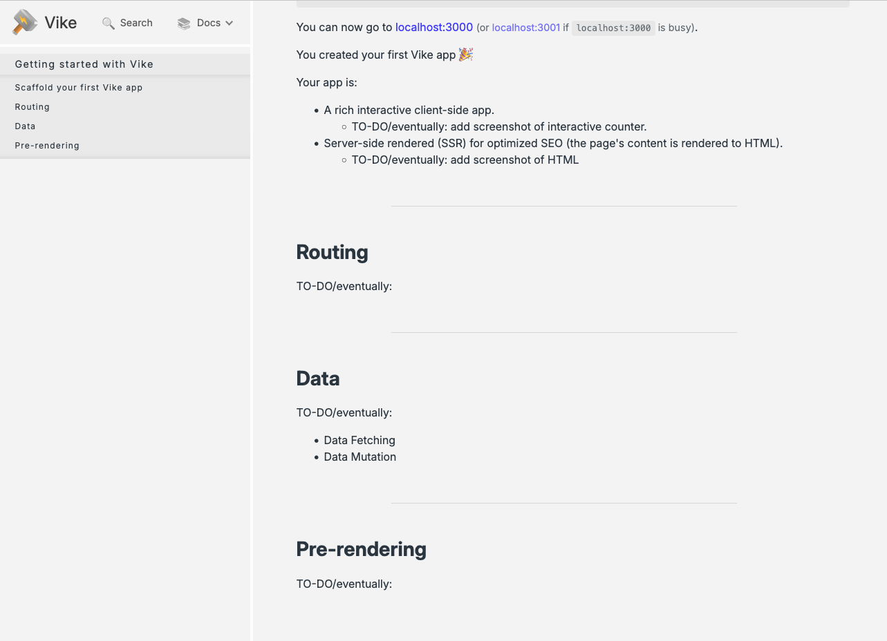

# Week 08 11/2/25

## Agenda

1. Media Query Exercise Review
2. Domains
3. Front-end frameworks
4. Setting up development for vue using express

## Media Query Exercise Review

Any questions?
Lets review PRs.

## Domains

Before we get started with terminal stuff, we need to configure some settings within our different domain providers. Basically we need to add the DigitalOcean servers to allowed servers on our domains. You can do this [here](https://docs.digitalocean.com/products/networking/dns/getting-started/dns-registrars/), which also specifies any specific domain registrar steps. 

Since I am using namecheap, I am going to add inside my domain settings. 
```
ns1.digitalocean.com
ns2.digitalocean.com
ns3.digitalocean.com
```

DigitalOcean has some really nice tutorials on how to setup domains and using nginx as a proxy to mask the ports we are using on our droplets. 
1) [Installing nginx](https://www.digitalocean.com/community/tutorials/how-to-install-nginx-on-ubuntu-20-04)
2) [Setting up HTTPS and reverse proxies](https://www.digitalocean.com/community/tutorials/how-to-configure-nginx-as-a-reverse-proxy-on-ubuntu-22-04)

...but I will copy and paste the steps here.

1. Install nginx
```sh
sudo apt update
sudo apt install nginx
```
2. Adjust firewall
```sh
sudo ufw status
```
which will print out
```sh
OutputStatus: active

To                         Action      From
--                         ------      ----
OpenSSH                    ALLOW       Anywhere                  
Nginx HTTP                 ALLOW       Anywhere                  
OpenSSH (v6)               ALLOW       Anywhere (v6)             
Nginx HTTP (v6)            ALLOW       Anywhere (v6)
```
If you are missing any of these, type. The name inside the quotes should be the missing name in the "To" column.
```sh
sudo ufw allow 'Nginx HTTP' 
```
If `sudo ufw status` says 'Status: inactive', run
```sh
sudo ufw enable
```
2. Set up server blocks
```sh
sudo vim /etc/nginx/sites-available/your_domain
```
Paste the configuration block (usually with right-click)
```sh
server {
    listen 80;
    listen [::]:80;

    server_name your_domain www.your_domain;
    
    location / {
        proxy_pass http://localhost:80/;
        include proxy_params;
    }
    location /project3/ {
        proxy_pass http://localhost:{whatever-port-you-used-for-project-3}/;
        include proxy_params;
    }
}
```
Exit by CTRL-C and typing `:wq`

Link to an enabled site:
```sh
sudo ln -s /etc/nginx/sites-available/your_domain /etc/nginx/sites-enabled/
```
Make sure there are no errors by using
```sh
sudo nginx -t
```
Once there are no errors, restart nginx
```sh
sudo systemctl restart nginx
```

Now check to see if your site is working with your domain!


3. Enabling HTTPS
Install certbot
```sh
sudo apt update
sudo apt install certbot python3-certbot-nginx
```
Get SSL certificate
```sh
sudo certbot --nginx -d your_domain.com -d www.your_domain.com
```
Auto-renew
```sh
sudo certbot renew --dry-run
```

## Front-End Frameworks

Right now we are creating different DOM elements on our webpage with plain Javascript and retrieving that information from the server. We can replace any of our front-end HTML/CSS and JavaScript with one of the below tools and still have our Express.js back-end server.

For lightweight applications it is typically better to make with the smallest tools available (plain HTML/CSS + JS, or using a [template engine](https://expressjs.com/en/guide/using-template-engines.html)). Typically sites that fall under the web art category are using these plain tools. But, when we move to more industry-based web, these are tools that are commonly used because they reduce the load on servers that may have thousands of users at a time. Because these front-end frameworks use *client-side* rendering (meaning the page is rendered on a persons computer instead of from the server).

When picking a tool, there are a good metric is to look at:
1) Who maintains it? Will this project last?
2) What other tools will it rely on? Will those projects last?
3) How easy is it to get started?
4) How many projects are using it now? 
    * For jobs, how many descriptions mention these specific tools?
5) Who is making things using these tools?
    * Is there a strong community around it? 
    * Are there substantial tutorials out there?

Generally speaking, they are all pretty similar and have skills that can translate between them (they are all based in JS after all). So it really is a matter of personal preference.

| | React.js | Angular.js | Vue.js | Svelte
|---|---|---|---|---|
| maintainer: | ~~meta~~ react foundation, part of the linux foundation as of [oct 2025](https://www.linuxfoundation.org/press/linux-foundation-announces-intent-to-launch-the-react-foundation)| google | some guy (Evan You) + community | some guy (Rich Harris, now at vercel) + community |
| bundler: | [any](https://react.dev/learn/build-a-react-app-from-scratch) | `build-angular` (webpack) | `create vue` (vite) | vite

### Front-end frameworks vs. Full-stack frameworks

In this class, we have been doing a combination of full-stack development by really getting into the weeds of what is front-end (HTML/CSS, Javascript) and back-end servers (Express.js).

There are tools out there that exist that do this entire process for us. I only mention these as potential next steps after this class as fun resources to learn. But, you wouldn't use *both* Next.js + Express.js OR React.js + Next.js

| | Next.js | Nuxt.js | 
|---|---|---|
| built on: | react.js | vue.js |
| maintainer: | vercel (many post-fb react devs) | some guys (Chopin, Parsa)
| bundler: | turbopack | vite

## Vue.js

Vue will be the framework that we will work with for the rest of the semester.  
For this upcoming weekend, there is a ton of educational material for free on https://vueschool.io/freeweekend.

But, they do have free courses online that will cover pretty much everything I went through today.
* [Vue Basics with Composition](https://vueschool.io/courses/vue-js-fundamentals-with-the-composition-api)
* [Vue Components](https://vueschool.io/courses/vue-component-fundamentals-with-the-composition-api)

### Setting up Vue and integrating Express

To begin our new vue projects, we have a little bit of a different starting point. After our `npm init -y`, we need to create a starter folder with all the vue setups. 

```sh
npm create vue@latest
```

* `create` allows us to setup all the vue files
* `vue@latest` installs the most recent version

Now we have a folder pre-built with a bunch of different settings. Looking at our `package.json`, there are a couple of new scripts:

```js
  "scripts": {
    "dev": "vite",
    "build": "vite build",
    "preview": "vite preview"
  },
```

[Vite](https://vite.dev/) is a bundling tool that allows us to compile all of our `.vue` scripts into a single minified file. In our terminal, if we run
```sh
npm run build
```

This will build and create a `./dist/` folder. If we look in this folder, there is an `index.html` and an `assets/` folder. Inside that folder is a generated `.js` file that is the result of the compiled `.vue`. We won't do anything with this folder, since it is the output of the build. 

Another option to build the `./dist/` is running run `vite build`. Another thing that is helpful here is to use the `--watch` flag. We can include that in the npm scripts: `"build": "vite build --watch"`, or we can run the `vite build --watch` command. It is really up to personal preference. The `--watch` flag will do the same thing that nodemon does, except it will rebuild the compiled `./dist/` folder instead of restarting the server.

#### Using our Express Server

Now, lets make sure we cancel out of any other commands (using CTRL-C) and have a regular terminal prompt to install express.

```sh
npm install express
```

Once we have installed it, we need to create our `server.js`.

##### `server.js`

```js
import express from 'express'

const app = express()

app.use(express.static('dist'))

app.listen(5001, ()=>{
    console.log('app is running at http://127.0.0.1:5001')
})
```

There are two main differences from this:
1) [JavaScript modules](https://developer.mozilla.org/en-US/docs/Web/JavaScript/Guide/Modules): using the `import...from`. This is because Vue / Vite use module syntax. 
2) Exposing the `./dist/` folder instead of the public folder. We could change the name of the build folder in our `vite.config.js`, but I find this solution easier. 

#### Running our projects locally

Instead of just running nodemon every time we want to test our code, we also need to run the build files every time we change the vue files. In order to do this, we need two terminals either via tabs, or I also use the split pane mode. 

On one terminal, we run the `vite build --watch` command ***OR*** `npm run build` if we changed our `package.json`  
On the other terminal, we run `nodemon server.js`

Great, now we are finally all set up to do our development.

#### Uploading to our server

For Cyberduck, we only need to upload our `./dist/` folder with our server.js. 

So, we want to drag the following files:
1) `./dist/`
2) `server.js`
3) `package.json`

After that, open terminal and `ssh root@your-ip-address`. Navigate to your project folder. This time, instead of running a plain package install, we want to use the `--production` flag. This will ensure it doesn't install any of the vite dev dependencies, since our project is already built out.
```sh
cd project4
npm install --production
```
Then we test our project is working
```sh
node server.js
```
If there are no errors, we CTRL-C out of that and add a running instance to our pm2
```sh
pm2 start server.js --name project4
```

### Vue syntax

Inside our generated `./src/`, we will be creating and editing `.vue` files. To start, lets look at our `App.vue`.

Vue files have 3 different tags in them:

* `<script setup>`
    * this is javascript
* `<template>`
    * this is html. we could make basic html files using vue!
* `<style>`, with optional `scoped` attribute 
    * this is css. we can also use static css inside of the `./src/assets/` folder. 

To create variables:
```js
const msg = ref('this is a variable')
```
Any variable created with `ref()` is able to be passed into the `<template>`. 

We can inject variables and other javascript code using the double moustache syntax `{{ msg }}`. We can do any single expression inside the `{{}}`, meaning something that evaluates to a specific value. This is using any of the [operators](https://developer.mozilla.org/en-US/docs/Web/JavaScript/Reference/Operators) that exist in javascript. 

Vue has some specific syntax that can be used inside of `<template>` and `<style>`, all prefixed by `v-`
* `v-for` : `for...of` loop
* `v-on` : event handler, shorthand of `@`
* `v-model` : allows us to sync variables defined by `ref()` and data coming in from the user
* `v-if` : `if` statement
* `ref()` : creates a "reactive reference". this is usually how we define variables
    * Note: if we want to access the value of the variable inside of the `<script>`, we need to use `.value`
    * Note: if we want to inject the variable into the `<template>`, we use `{{}}`
* `onMounted( () => {})` : wait for a component to be loaded, just like `window.onload`

### Components and Props

A similarity between most front-end frameworks is through the use of components and props. This was standardized by React.js, and thus has similar functionality.  
A component is simply a broken down / smaller file that handles a specific, but repeatable, part of the webpage. Think of it like a function for HTML.

Usually, components live in their own folder inside `./src/`. So, make `./src/components/` to make our component files. 

***A Note On Naming***: components should always be two words so they don't interfere with HTML elements, or future HTML elements. See [style guide](https://vuejs.org/style-guide/) for more details.

Any components need to be imported in the files they are used in. As an example:

```js
// parent component
<script setup>
import CounterButton from "./components/CounterButton.vue"
</script>

<template>
    <CounterButton></CounterButton>

    {/* we can also use self-closing tags */}
    <CounterButton />
</template>
```

In our `./src/components/CounterButton.vue`
```js
// child component
<script setup>
</script>
<template>
    <h1>hi</h1>
</template>
```

#### Props

We can pass in properties (or `props`) from one component to another using attributes in html.
```js
// parent component
<script setup>
import GreetUser from "./components/GreetUser.vue"
</script>

<template>
    <GreetUser name="Sam"/>
</template>
```

In our `./src/components/GreetUser.vue`
```js
// child component
<script setup>
    definePropes(['name'])
</script>
<template>
    <h1>hi {{name}}</h1>
</template>
```

### Other Ways to use Vue

There are a lot of different ways to build vue, and we are using the default vue + vite bundler. 

1) [Using CDN](https://vuejs.org/guide/quick-start.html#using-vue-from-cdn) by importing vue from a script tag.
```html
<script src="https://unpkg.com/vue@3/dist/vue.global.js"></script>
```
This requires us to use `<script type=module>` AND we need to ensure we are running a server (whether from liveserver, express, or http-server).

2) [Server-Side Rendering](https://vite.dev/guide/ssr.html#server-side-rendering-ssr)
This allows us to put the load on the server instead of the client to render specific files. This basically means we can skip the `fetch()` requests in order to render data from the server to the client. 
    * This is very similar to using templating tools as mentioned above.
    * There is allegedly a nice tool for this: https://vike.dev/, but it does not have a lot of users or maintenance.



3) [Petite Vue](https://github.com/vuejs/petite-vue)
Really tiny library to use vue and not use build steps. 

As a note, if ***I*** were to use Vue in the context of making small, playful, projects, I would likely use petite-vue. You are welcome to explore any of these methods for this class, but note that industry uses of vue will likely use vite.

## Other references

* [Vue router vs. Express](https://imagewize.com/building-a-store-with-vue-part-nine-express-routes-controllers/)
* [Vue CSS](https://vuejs.org/api/sfc-css-features.html)
* [Vue Style Guide](https://vuejs.org/style-guide/)
