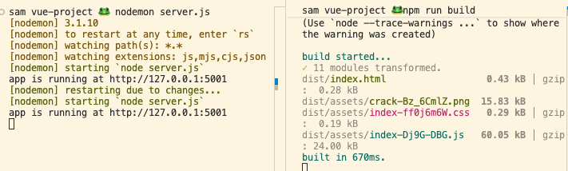

# Week 09 11/10/25

## Agenda

1. Domain Fix
2. Continue Vue
3. Artist talk @ 3.30pm with Queenie!
4. Project 4 Reading Discussion & Critique

## Domain Fix

1. Log in to your server using `ssh root@your-ip`
2. Enable HTTPS on your firewall.

```sh
sudo ufw allow 'Nginx Full'
```

If that doesn't work, let's generate a new config file : https://www.digitalocean.com/community/tools/nginx 

## Vue (continued)

Discussion: Did anyone spend some time with Vue school over the weekend? Any fun new items to share?

### Starting up our Vue Project (again)

To practice creating a Vue project, here are the same instructions from last time (but concise):

1. Navigate to the folder you want to create the new project
2. Run `npm init -y`. If this command doesn't work, run `npm init` and press enter until you are prompted for "yes"
3. Run `npm install vue@latest`. You can name the project if you want, so I will call it `class_09_demo`. Press enter to continue.
4. Change directory into your new folder: `cd class_09_demo`
5. Add the `--watch` to the build script in `package.json`: like so `"build": "vite build --watch",`
6. Install express `npm install express`
7. Create our `server.js` file (you can copy from the previous server, or look at the [previous notes](https://github.com/samheckle/web-projects-fa-25/tree/main/classes/week_08#serverjs) )

### Running our Vue Project (again)

Open a new split terminal/git bash in vs code. On one side, you will run our regular server command `nodemon server.js`, on the other side, you will run `npm run build`. It should look something like:



Resuming from [last time](https://github.com/samheckle/web-projects-fa-25/tree/main/classes/week_08#vue-syntax)

## Artist Talk

Queenie Wu [Website](https://www.queeniwu.com/) | [LinkedIn](https://www.linkedin.com/in/sqwu/) will be coming to our class to talk about her work! Specifically, she will share a project titled "How to Break Up with a Tab". 

Spend some time thinking of questions you would want to ask a working designer with an active artistic practice, and we will add them here:


## Project 4 Reading Discussion & Critique

### Reading Discussion
1) How has user vs. programmer vs. person evolved in the year 2025? Where does AI come into this?
2) Does the internet reflect reality? Is it completely separate from reality? [Place yourself](https://cryptpad.fr/whiteboard/#/2/whiteboard/edit/2xsNMh3f9Hl0afCggpmwK0rf/)

### Project 4 Critique

Given what you just saw about Queenie's work, think about your project 4. What new elements will you add to it?

In the [shared figma]() make quick mockups/sketches of your intended sites. You are welcome to draw them on pen / paper and upload those files. How will you take inspiration from American Artist and Lialina's readings?


